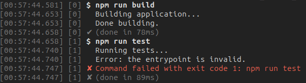

<picture>
	<source media="(prefers-color-scheme: dark)" srcset="media/logo_dark.svg">
	
</picture>
<br>

[](https://codecov.io/gh/sindresorhus/execa)

> Process execution for humans

<br>

---

<div align="center">
	<p>
		<p>
			<sup>
				<a href="https://github.com/sponsors/sindresorhus">Sindre's open source work is supported by the community</a>
			</sup>
		</p>
		<sup>Special thanks to:</sup>
		<br>
		<br>
		<a href="https://transloadit.com?utm_source=sindresorhus&utm_medium=referral&utm_campaign=sponsorship&utm_content=execa">
			<picture>
				<source width="360" media="(prefers-color-scheme: dark)" srcset="https://sindresorhus.com/assets/thanks/transloadit-logo-dark.svg">
				<source width="360" media="(prefers-color-scheme: light)" srcset="https://sindresorhus.com/assets/thanks/transloadit-logo.svg">
				
			</picture>
		</a>
		<br>
		<br>
		<a href="https://coderabbit.ai?utm_source=sindre&utm_medium=execa">
			
		</a>
		<br>
		<br>
	</p>
</div>

---

<br>

Execa runs commands in your script, application or library. Unlike shells, it is [optimized](docs/bash.md) for programmatic usage. Built on top of the [`child_process`](https://nodejs.org/api/child_process.html) core module.

---

One of the maintainers [@ehmicky](https://github.com/ehmicky) is looking for a remote full-time position. Specialized in Node.js back-ends and CLIs, he led Netlify [Build](https://www.netlify.com/platform/core/build/), [Plugins](https://www.netlify.com/integrations/) and Configuration for 2.5 years. Feel free to contact him on [his website](https://www.mickael-hebert.com) or on [LinkedIn](https://www.linkedin.com/in/mickaelhebert/)!

---

## Features

- [Simple syntax](#simple-syntax): promises and [template strings](docs/execution.md#template-string-syntax), like [`zx`](docs/bash.md).
- [Script](#script) interface.
- [No escaping](docs/escaping.md) nor quoting needed. No risk of shell injection.
- Execute [locally installed binaries](#local-binaries) without `npx`.
- Improved [Windows support](docs/windows.md): [shebangs](docs/windows.md#shebang), [`PATHEXT`](https://ss64.com/nt/path.html#pathext), [and more](https://github.com/moxystudio/node-cross-spawn?tab=readme-ov-file#why).
- [Detailed errors](#detailed-error) and [verbose mode](#verbose-mode), for [debugging](docs/debugging.md).
- [Pipe multiple subprocesses](#pipe-multiple-subprocesses) better than in shells: retrieve [intermediate results](docs/pipe.md#result), use multiple [sources](docs/pipe.md#multiple-sources-1-destination)/[destinations](docs/pipe.md#1-source-multiple-destinations), [unpipe](docs/pipe.md#unpipe).
- [Split](#split-into-text-lines) the output into text lines, or [iterate](#iterate-over-text-lines) progressively over them.
- Strip [unnecessary newlines](docs/lines.md#newlines).
- Get [interleaved output](#interleaved-output) from `stdout` and `stderr` similar to what is printed on the terminal.
- Retrieve the output [programmatically and print it](#programmatic--terminal-output) on the console at the same time.
- [Transform or filter](#transformfilter-output) the input and output with [simple functions](docs/transform.md).
- Redirect the [input](docs/input.md) and [output](docs/output.md) from/to [files](#files), [strings](#simple-input), [`Uint8Array`s](docs/binary.md#binary-input), [iterables](docs/streams.md#iterables-as-input) or [objects](docs/transform.md#object-mode).
- Pass [Node.js streams](docs/streams.md#nodejs-streams) or [web streams](#web-streams) to subprocesses, or [convert](#convert-to-duplex-stream) subprocesses to [a stream](docs/streams.md#converting-a-subprocess-to-a-stream).
- Ensure subprocesses exit even when they [intercept termination signals](docs/termination.md#forceful-termination), or when the current process [ends abruptly](docs/termination.md#current-process-exit).

## Install

```sh
npm install execa
```

## Documentation

Execution:
- ▶️ [Basic execution](docs/execution.md)
- 💬 [Escaping/quoting](docs/escaping.md)
- 💻 [Shell](docs/shell.md)
- 📜 [Scripts](docs/scripts.md)
- 🐢 [Node.js files](docs/node.md)
- 🌐 [Environment](docs/environment.md)
- ❌ [Errors](docs/errors.md)
- 🏁 [Termination](docs/termination.md)

Input/output:
- 🎹 [Input](docs/input.md)
- 📢 [Output](docs/output.md)
- 📃 [Text lines](docs/lines.md)
- 🤖 [Binary data](docs/binary.md)
- 🧙 [Transforms](docs/transform.md)

Advanced usage:
- 🔀 [Piping multiple subprocesses](docs/pipe.md)
- ⏳️ [Streams](docs/streams.md)
- 📞 [Inter-process communication](docs/ipc.md)
- 🐛 [Debugging](docs/debugging.md)
- 📎 [Windows](docs/windows.md)
- 🔍 [Difference with Bash and zx](docs/bash.md)
- 🤓 [TypeScript](docs/typescript.md)
- 📔 [API reference](docs/api.md)

## Examples

### Execution

#### Simple syntax

```js
import {execa} from 'execa';

const {stdout} = await execa`npm run build`;
// Print command's output
console.log(stdout);
```

#### Script

```js
import {$} from 'execa';

const {stdout: name} = await $`cat package.json`.pipe`grep name`;
console.log(name);

const branch = await $`git branch --show-current`;
await $`dep deploy --branch=${branch}`;

await Promise.all([
	$`sleep 1`,
	$`sleep 2`,
	$`sleep 3`,
]);

const directoryName = 'foo bar';
await $`mkdir /tmp/${directoryName}`;
```

#### Local binaries

```sh
$ npm install -D eslint
```

```js
await execa({preferLocal: true})`eslint`;
```

#### Pipe multiple subprocesses

```js
const {stdout, pipedFrom} = await execa`npm run build`
	.pipe`sort`
	.pipe`head -n 2`;

// Output of `npm run build | sort | head -n 2`
console.log(stdout);
// Output of `npm run build | sort`
console.log(pipedFrom[0].stdout);
// Output of `npm run build`
console.log(pipedFrom[0].pipedFrom[0].stdout);
```

### Input/output

#### Interleaved output

```js
const {all} = await execa({all: true})`npm run build`;
// stdout + stderr, interleaved
console.log(all);
```

#### Programmatic + terminal output

```js
const {stdout} = await execa({stdout: ['pipe', 'inherit']})`npm run build`;
// stdout is also printed to the terminal
console.log(stdout);
```

#### Files

```js
// Similar to: npm run build > output.txt
await execa({stdout: {file: './output.txt'}})`npm run build`;
```

#### Simple input

```js
const {stdout} = await execa({input: getInputString()})`sort`;
console.log(stdout);
```

#### Split into text lines

```js
const {stdout} = await execa({lines: true})`npm run build`;
// Print first 10 lines
console.log(stdout.slice(0, 10).join('\n'));
```

### Streaming

#### Iterate over text lines

```js
for await (const line of execa`npm run build`) {
	if (line.includes('WARN')) {
		console.warn(line);
	}
}
```

#### Transform/filter output

```js
let count = 0;

// Filter out secret lines, then prepend the line number
const transform = function * (line) {
	if (!line.includes('secret')) {
		yield `[${count++}] ${line}`;
	}
};

await execa({stdout: transform})`npm run build`;
```

#### Web streams

```js
const response = await fetch('https://example.com');
await execa({stdin: response.body})`sort`;
```

#### Convert to Duplex stream

```js
import {execa} from 'execa';
import {pipeline} from 'node:stream/promises';
import {createReadStream, createWriteStream} from 'node:fs';

await pipeline(
	createReadStream('./input.txt'),
	execa`node ./transform.js`.duplex(),
	createWriteStream('./output.txt'),
);
```

### Debugging

#### Detailed error

```js
import {execa, ExecaError} from 'execa';

try {
	await execa`unknown command`;
} catch (error) {
	if (error instanceof ExecaError) {
		console.log(error);
	}
	/*
	ExecaError: Command failed with ENOENT: unknown command
	spawn unknown ENOENT
			at ...
			at ... {
		shortMessage: 'Command failed with ENOENT: unknown command\nspawn unknown ENOENT',
		originalMessage: 'spawn unknown ENOENT',
		command: 'unknown command',
		escapedCommand: 'unknown command',
		cwd: '/path/to/cwd',
		durationMs: 28.217566,
		failed: true,
		timedOut: false,
		isCanceled: false,
		isTerminated: false,
		isMaxBuffer: false,
		code: 'ENOENT',
		stdout: '',
		stderr: '',
		stdio: [undefined, '', ''],
		pipedFrom: []
		[cause]: Error: spawn unknown ENOENT
				at ...
				at ... {
			errno: -2,
			code: 'ENOENT',
			syscall: 'spawn unknown',
			path: 'unknown',
			spawnargs: [ 'command' ]
		}
	}
	*/
}
```

#### Verbose mode

```js
await execa`npm run build`;
await execa`npm run test`;
```



## Related

- [gulp-execa](https://github.com/ehmicky/gulp-execa) - Gulp plugin for Execa
- [nvexeca](https://github.com/ehmicky/nvexeca) - Run Execa using any Node.js version

## Maintainers

- [Sindre Sorhus](https://github.com/sindresorhus)
- [@ehmicky](https://github.com/ehmicky)
